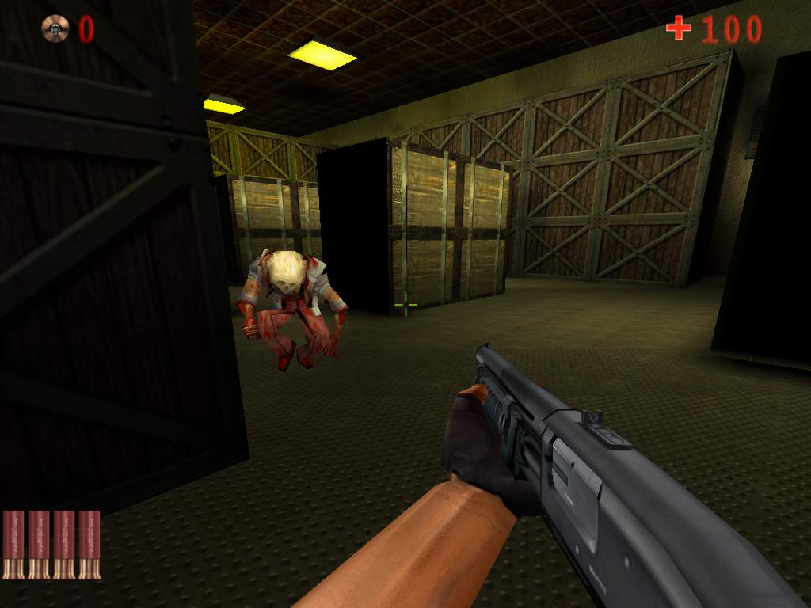



## A 3D Shooter Game \(Half\-Life Style\)

### Description

.:Zombie 3D Action Demo:.

1. Introdution.

2. Installation

3. System Requrements

4. Developer Info.

5. Contacts.

1. Introduction. Zombie Demo - is full functional 3D action demo with weapons, enemies and mission. You have to collect lost CD's in the lost laboratory, be be careful - there are zombies, which are very hungry and will hunt for you blood. The map for this game was made by it's author Alex (dubralex@yandex.ru). Weapons and zombie model had been taken from Quake II and Half-Life games and mods for them.

2. This game uses iRender 3D game engine. The last version of it can be found in the folder Bin of the game. To register it just replace the extension dl_ to dll and change the registrator extension from ex_ to exe. After that run the registrator and click button "register". After that open the project "Zombie.vbp" and compile the code. If there will be troubles with the library, connect it to project manually. In Visual Basic Menu click Project->References find iRender 3D Engine there (if there no engine click brouse and find it) and add it to project.

3. This game run with PIII 450, 196 RAM, 16 mb video card. DirectX 8 or higher also needed.

4. This game is only sample of iRender 3D game technology. iRender 3D is now one of the most powerfull game engines for Visual Basic. It developes from day to day and becomes more and more powerfull. Visit iRender homepage at http://irender3d.com.

5. You can contact the authors of the engine OrBit (asdvb@mail.ru), Alex (dubralex@yandex.ru) for more info. Contact Alex if you have quastions about this game.

http: 	www.irender3d.com

mailto:	support@irender3d.com
 
### More Info
 

             |
---                |---
**Submitted On**   |2005-02-25 08:39:56
**By**             |[iR\_OrBit](https://github.com/Planet-Source-Code/PSCIndex/blob/master/ByAuthor/ir-orbit.md)
**Level**          |Advanced
**User Rating**    |4.5 (144 globes from 32 users)
**Compatibility**  |VB 6\.0
**Category**       |[DirectX](https://github.com/Planet-Source-Code/PSCIndex/blob/master/ByCategory/directx__1-44.md)
**World**          |[Visual Basic](https://github.com/Planet-Source-Code/PSCIndex/blob/master/ByWorld/visual-basic.md)
**Archive File**   |[A\_3D\_Shoot1857502252005\.zip](https://github.com/Planet-Source-Code/ir-orbit-a-3d-shooter-game-half-life-style__1-59142/archive/master.zip)

